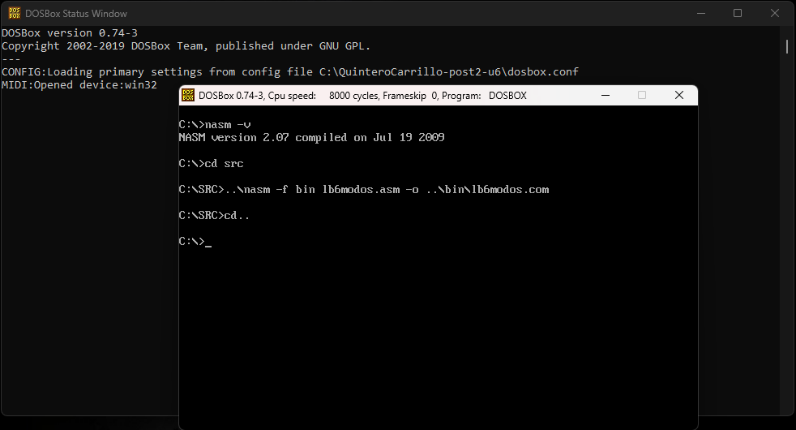
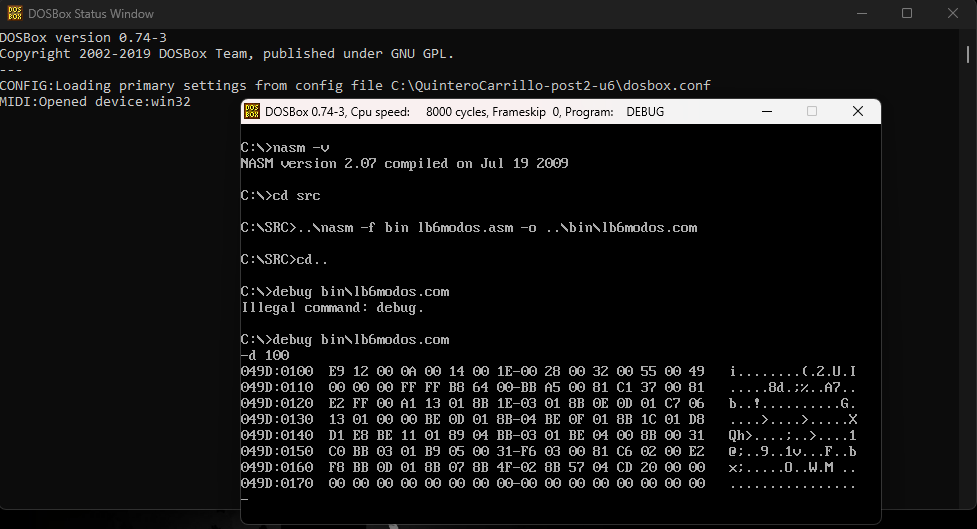
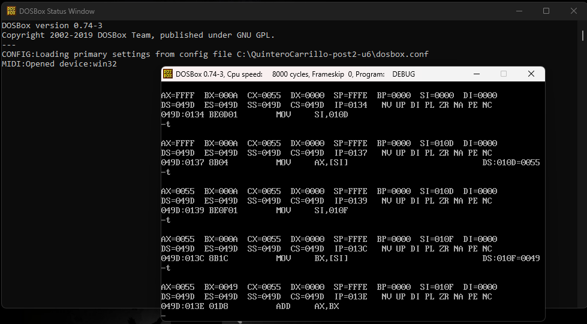
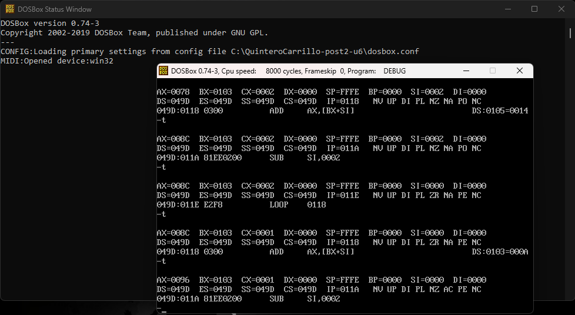

# Laboratorio 6 — Modos de Direccionamiento x86

**Estudiante:** Neidys Mariana Quintero Carrillo 
**Código:** 115244
**Curso:** Arquitectura de Computadores  
**Programa:** Ingeniería de Sistemas  
**Universidad:** Francisco de Paula Santander  
**Año:** 2026

## Descripción del laboratorio

Este laboratorio implementa un programa en NASM que demuestra de forma
explícita y verificable cuatro modos de direccionamiento distintos de la
arquitectura x86: inmediato, directo, indirecto por registro e indexado con
base, índice y desplazamiento. Para cada modo se documenta la dirección
efectiva calculada y los valores de los registros involucrados mediante
trazado en DEBUG dentro de DOSBox.

---

## Entorno utilizado

| Componente | Versión / Detalle |
|---|---|
| Sistema operativo anfitrión | Windows [10/11] |
| DOSBox | 0.74-3 |
| NASM para DOS | 2.07 (Jul 19 2009) |
| CWSDPMI | csdpmi5b |
| Editor de texto | Notepad++ |

---

## Estructura del repositorio
```
QuinteroCarrillo-post2-u6/
├── src/
│   ├── modos.asm      # Programa principal - 4 modos de direccionamiento
│   └── inv.asm        # Extension: recorrido inverso del array
├── bin/
│   ├── modos.com      # Ejecutable programa principal
│   └── inv.com        # Ejecutable recorrido inverso
├── capturas/
│   ├── cp1_compilacion.png      # Checkpoint 1: compilacion exitosa
│   ├── cp1_dump_array.png       # Checkpoint 1: volcado memoria DEBUG
│   ├── cp2_modo_indirecto.png   # Checkpoint 2: trazado modo indirecto
│   ├── cp3_bucle_indexado.png   # Checkpoint 3: AX=150 bucle indexado
│   └── cp3_inverso.png          # Checkpoint 3: AX=150 recorrido inverso
├── dosbox.conf        # Configuracion DOSBox
└── README.md          # Este archivo
```
---

## Tabla resumen de los 4 modos de direccionamiento

| Modo | Fórmula dirección efectiva | Instrucción NASM usada | Valor observado en DEBUG |
|---|---|---|---|
| Inmediato | El valor está en el opcode | `MOV ax, 100` | AX=0064h (100) |
| Directo | EA = dirección fija en instrucción | `MOV ax, [var_x]` | AX=FFFFh |
| Indirecto por registro | EA = contenido del registro | `MOV ax, [si]` | AX=0055h (85) |
| Indexado | EA = Base + Índice | `MOV ax, [bx+si]` | AX=001Eh (30) |

---

## Descripción de cada modo

### Modo 1 — Inmediato
El operando es una constante embebida directamente en el código de la
instrucción. Al desensamblar con DEBUG comando U se observa el valor
dentro del opcode. No genera acceso adicional a memoria de datos.

```nasm
MOV ax, 100      ; AX = 0064h — valor en el opcode
MOV bx, 0A5h     ; BX = 00A5h
ADD cx, 55       ; CX += 37h
AND dx, 00FFh    ; DX AND mascara inmediata
```

### Modo 2 — Directo
La dirección absoluta del operando está fija en la instrucción en tiempo
de compilación. DEBUG muestra la dirección en el opcode con el comando U.

```nasm
MOV ax, [var_x]       ; AX = mem[dir_var_x] = FFFFh
MOV bx, [array]       ; BX = mem[dir_array] = 000Ah (10)
MOV cx, [nota1]       ; CX = mem[dir_nota1] = 0055h (85)
MOV [var_x], word 0   ; escribe 0 en memoria
```

### Modo 3 — Indirecto por registro
El registro SI contiene la dirección del operando. La dirección puede
cambiar en tiempo de ejecución — base del concepto de puntero.

```nasm
MOV si, nota1    ; SI = 010Dh (direccion de nota1)
MOV ax, [si]     ; AX = mem[SI] = 0055h (85)
MOV si, nota2    ; SI = 010Fh (direccion de nota2)
MOV bx, [si]     ; BX = mem[SI] = 0049h (73)
```

### Modo 4 — Indexado (Base + Índice)
La dirección efectiva se calcula sumando un registro base y un índice.
Permite recorrer arrays y estructuras de forma flexible.

```nasm
MOV bx, array    ; BX = direccion base
MOV si, 4        ; SI = indice (elemento 2 * 2 bytes)
MOV ax, [bx+si]  ; AX = array[2] = 001Eh (30)
```

---

## Tabla de trazado del modo indirecto (Checkpoint 2)

| Instrucción | Registro modificado | Valor resultante |
|---|---|---|
| MOV si, nota1 | SI | 010Dh |
| MOV ax, [si] | AX | 0055h (85) |
| MOV si, nota2 | SI | 010Fh |
| MOV bx, [si] | BX | 0049h (73) |
| ADD ax, bx | AX | 009Eh (158) |
| SHR ax, 1 | AX | 004Fh (79) |
| MOV si, promedio | SI | 0111h |
| MOV [si], ax | mem[0111h] | 004Fh (79) |

---

## Extensión — Recorrido inverso del array

Se modificó el programa para recorrer el array desde `array[4]` hasta
`array[0]` usando SI con decremento de 2 en cada iteración:

```nasm
XOR ax, ax          ; AX = 0
MOV bx, array       ; BX = base
MOV cx, 5           ; CX = 5 elementos
MOV si, 8           ; SI = 8 (apunta al ultimo elemento)
.bucle_inverso:
    ADD ax, [bx+si] ; AX += array[si/2]
    SUB si, 2       ; retroceder 2 bytes
    LOOP .bucle_inverso
; AX = 50+40+30+20+10 = 150 = 0096h
```

El resultado es el mismo (AX=0096h=150) porque la suma es conmutativa,
pero el orden de acceso a memoria es inverso, lo que se puede verificar
observando los valores intermedios de AX en el trazado DEBUG.

---

## Capturas del proceso

### Checkpoint 1 — Compilación y volcado de memoria



### Checkpoint 2 — Trazado modo indirecto


### Checkpoint 3 — Bucle indexado y recorrido inverso



---

## Resultados obtenidos

| Checkpoint | Descripción | Resultado esperado | 
|---|---|---|
| CP1 | Compilación y dump memoria | Array visible en little-endian | 
| CP2 | Trazado modo indirecto | AX=0055h (85) via SI | 
| CP3 | Bucle indexado AX=150 | AX=0096h | 
| CP3 ext | Recorrido inverso AX=150 | AX=0096h | 

---

## Conclusiones

- Los modos de direccionamiento determinan cómo el procesador calcula
  la dirección efectiva del operando, siendo el modo inmediato el más
  rápido al no requerir acceso adicional a memoria.
- El modo indirecto por registro implementa el concepto de puntero a
  nivel de hardware, permitiendo que la dirección del dato cambie en
  tiempo de ejecución simplemente modificando el registro base.
- El modo indexado con base e índice es fundamental para recorrer
  arrays y estructuras, ya que la dirección efectiva se calcula como
  EA = Base + Índice, permitiendo acceso flexible a cualquier elemento.
- El recorrido inverso del array produce el mismo resultado (150) que
  el recorrido directo porque la suma es conmutativa, pero demuestra
  que el modo indexado permite cambiar el orden de acceso simplemente
  modificando la dirección del índice.

---
